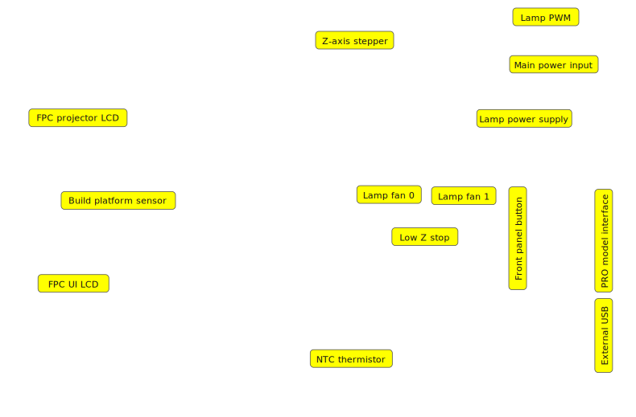

# Photon Mono M7 NanoDLP Modification

## Overview

Modification of the Anycubic Photon Mono M7 SLA printer to run NanoDLP. The original mainboard is replaced with a Raspberry Pi, NanoDLP Controller Board, and BHTM08 display driver. All mechanical parts and most electrical components are reused.

## Electronics

### Replaced
| Component | Replacement |
|-----------|-------------|
| Original mainboard | Raspberry Pi + NanoDLP Controller Board + BHTM08 |

### Reused
- Display (DBM101M14K01) — driven by BHTM08 instead of original board
- UV lamp
- Z-axis stepper motor
- Limit switches
- Fans
- Power supply

## New Components

### Display Driver: BHTM08
- HDMI to MIPI DSI converter board by Shenzhen Aptus Technology
- Supports MONO LCD 9K/12K/14K
- Power: 5V via USB Type-C
- PCB size: 54x54mm, mounting holes φ3mm
- FPGA: Intel MAX 10 (10M13_9M16_V1.1)
- Interfaces: HDMI input, MIPI DSI output to display
- Spec: `doc/BHTM08 HDMI TO MIPI DSI DRIVER BOARD SPEC V1.0.pdf`

### CPU: Raspberry Pi
- Model TBD (Pi 4B or Pi 5 recommended for 14K image processing performance)
- Connected to NanoDLP Controller Board via wires/cables

### NanoDLP Controller Board
- [Standalone board by nano3dtech.com](https://www.nano3dtech.com/nanodlp-controller-board), connected to Raspberry Pi via wires
- Powers the Raspberry Pi (Pi should not have separate power supply)
- TMC2209 integrated stepper driver (Z-axis)
- HDMI output → BHTM08 → display
- Ethernet port (preferred over WiFi)
- Power input: 12-24V, 5-20A (reuse original M7 PSU)
- UV LED driver connector
- Limit switch inputs (min endstop required, max optional)
- 5x fan connectors
- Comes with 8GB SD card pre-loaded with NanoDLP

## Display: DBM101M14K01

- Manufacturer: Shenzhen Aptus Technology
- 10.1" TFT MONO (Transmissive), 13320x5120 pixels (14K)
- Outline: 230x142x1.06mm, Viewing area: 223.78x126.98mm
- Pixel size: 0.0168x0.0248mm
- Interface: 8-lane MIPI DSI, 51-pin FPC (connector: XVT:0-511822JT-5)
- Power: AVDD +5.5V, AVEE -5.5V, IOVCC 1.8V, IDD max 150mA
- Reset: active low, min 10µs pulse
- Spec: `doc/DBM101M14K01 Specification.pdf`

### NanoDLP Display Timing
| Parameter | Value |
|-----------|-------|
| Resolution | 13320x5120 |
| Frame rate | 15 Hz |
| PCLK | 359 MHz |
| HACT | 4440 |
| HS | 10 |
| HBP | 72 |
| HFP | 74 |
| H_total | 4596 |
| VACT | 5120 |
| VS | 4 |
| VBP | 16 |
| VFP | 77 |
| V_total | 5217 |

## Original Mainboard Connectors

Coordinates are XY in mm, origin at top-left corner of the board.

| Connector | Type | Pins | Position (mm) | Notes |
|-----------|------|------|---------------|-------|
| Projector LCD panel | FPC | 50 | 0, 25 | MIPI DSI to DBM101M14K01 |
| UI LCD panel | FPC | 50 | 0, 60 | Touchscreen UI display |
| Build platform sensor | JST 2mm | 4 | 20, 46 | I2C, unknown sensor (possibly strain/force for release detection) |
| NTC thermistor | JST 2.54mm | 2 | 70, 80 | NTC 100k on UV lamp heatsink |
| Z-axis stepper | JST 2.54mm | 4 | 90, 0 | Z-axis stepper motor |
| Lamp PWM | JST 2.54mm | 2 | 105, 0 | UV lamp PWM control |
| Lamp fan 0 | JST 2.54mm | 2 | 83, 35 | UV lamp cooling fan |
| Lamp fan 1 | JST 2.54mm | 2 | 93, 35 | UV lamp cooling fan |
| Lamp power supply | Latched, 3.75mm | 2 | 115, 25 | Power to UV lamp (connector type TBD) |
| Main power input | Terminal block | 2 | 115, 12 | Input from main PSU |
| External USB | JST 2mm | 5 | 116, 67 | External USB port |
| Front panel button | JST 2.54mm | 4 | 110, 50 | Power button + LED (TBC) |
| Low Z stop | JST 2.54mm | 3 | 85, 56 | Z-axis min endstop |
| PRO model interface | JST 2mm | 8 | 116, 50 | Interface for PRO variant (function TBD) |
| WiFi | IPX | 1 | 80, 60 | WiFi module connector |

## Verified

- BHTM08 works correctly with DBM101M14K01
- Tested by connecting a notebook via HDMI to BHTM08, which drove the display successfully
